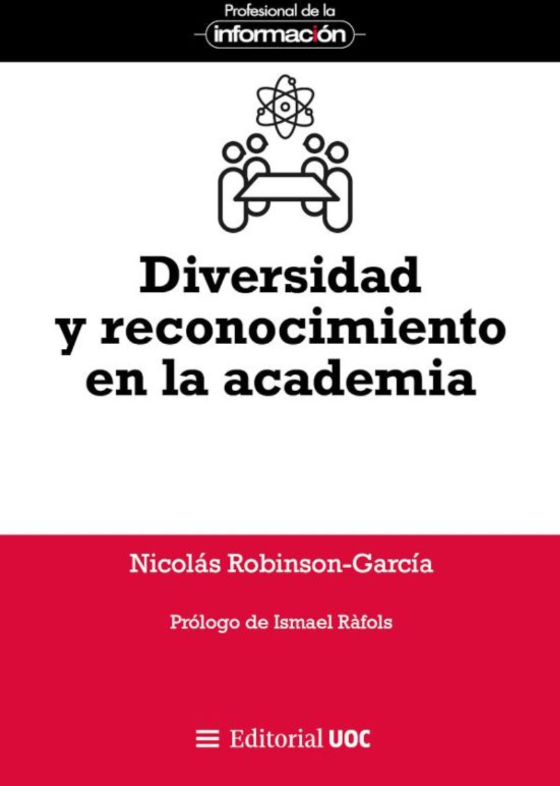

## Bio

Nicolas Robinson-Garcia is a Ramón y Cajal fellow in the field of bibliometrics and research evaluation at the University of Granada. He is scientific director of the [Unit for Computational Humanities and Social Sciences (U-CHASS)](https://uchass.ugr.es) and head of the [EC3 Research Group](https://ec3-research.com). He is co-editor of the journal [Research Evaluation](https://academic.oup.com/rev/), and member of the Steering Committee of the [European Summer School for Scientometrics](https://esss.info). His research interests are research careers and diversity, and science communication and social outreach. He is also member of the editorial board of [Quantitative Science Studies](https://direct.mit.edu/qss).

---

📘 **New book: _Diversidad y reconocimiento en la academia_**

{width=120px style="float:left; margin-right:15px; margin-top:5px; border-radius:8px; box-shadow:0 2px 6px rgba(0,0,0,.1);"}

La imagen del científico aislado en su laboratorio pertenece al pasado. Hoy, la ciencia es un esfuerzo colectivo en el que la diversidad ?de ideas, trayectorias y perspectivas? es clave para generar conocimiento que refleje la complejidad del mundo en que vivimos. Este libro explora cómo se reconoce y valora la contribución de los científicos, qué retos afronta el sistema académico y cómo avanzar hacia una evaluación más justa e inclusiva. Una lectura imprescindible para investigadores, gestores y cualquier persona interesada en entender cómo se hace ciencia en el siglo XXI.

**[→ Más información y compra en Casa del Libro](https://www.casadellibro.com/libro-diversidad-y-reconocimiento--en-la-academia/9788411661805/17478911)**

---

## Main research projects (active)

Check complete [list of projects here](projects.html)

**Scientific Teams and Inequalities: Collaboration and Heterogeneity in Science (STITCH)** | Funded by the Spanish National Research Agency

**[Unit for Computational Humanities and Social Sciences (U-CHASS)](https://uchass.ugr.es)** | Research unit funded by the University of Granada

## Teaching

**[Courses](https://sites.google.com/go.ugr.es/nrobinsongarcia-docencia)** | Portal with materials of courses currently taught at University of Granada

**[ESSS](https://esss.info)** | European Summer School for Scientometrics

**[#yosigopublicando](https://yosigopublicando.ugr.es)** | Online teaching platform for early career researchers

## Outputs

**[Publications](pubs.html)** | Papers, chapters and whatnot.

**[Bibliometría o Barbarie](https://ec3-research.com/podcast/)** | Podcast on scientometrics

**[Talks](talks.html)** | Talks and invited lectures

**[Outreach](outreach.html)** | Opinion pieces, blog posts and comments

## PhD supervision

**[Elvira González-Salmón](https://sites.google.com/go.ugr.es/egonzalezsalmon)** | PhD on Social Sciences, Universidad de Granada (on-going)

**[Victoria Di Césare](https://sites.google.com/view/vdicesare)** | PhD on Social Sciences, Universidad de Granada (on-going)

**[Néstor Mir Planells](https://nestormirplanells.wordpress.com/)** | PhD on Library Studies, Universitat Politècnica de València (on-going)

**[Alwaleed Alkhaja](https://creativecommons.org/person/alwaleed-alkhaja/)** | PhD on Library Studies, University of Tampere (on-going)