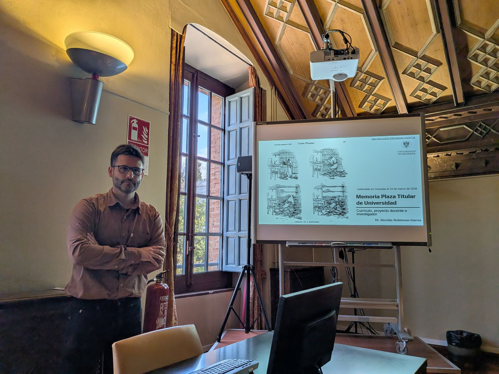

{fig-align="center"}

> We are coming to understand that science is not a haphazard collection of manufacturing techniques carried out by a race of laboratory dwellers with acid-yellow fingers and steel-rimmed spectacles and no home life (Bronowski, [The Common Sense of Science](https://www.hup.harvard.edu/books/9780674146518), 1978)

Last Tuesday, March 24, I successfully completed my tenure evaluation and became an associate professor, bringing to a close a long period of research contracts that began in 2015, a year after defending my PhD. This journey has taken me to Valencia (INGENIO), Atlanta (Georgia Tech), back to Valencia (INGENIO), Delft (TU Delft), and finally to Granada in 2021.

It has been a wonderful journey that has enriched me greatly and allowed me to build meaningful friendships along the way, meeting people who have had, and continue to have, a profound influence on me both academically and personally. I won’t attempt to name them all here, although I have tried to thank each of them individually.

Thank you all, and let’s keep going!

::: {.callout-important appearance="simple"}
## Slides and recording of the seminar are available

-   [Defense of the CV, research and teaching project](https://doi.org/10.5281/zenodo.19134021)

-   [Slides for the Defense](https://doi.org/10.5281/zenodo.19200717)
:::

