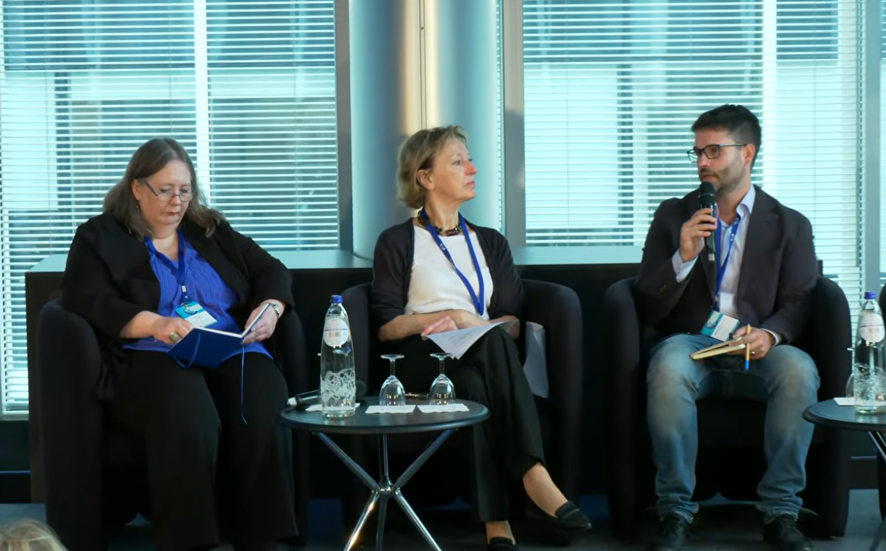

El pasado 1 de octubre tuve la oportunidad de participar en la jornada que celebró la Comisión Europea en Bruselas para el lanzamiento del Informe Science, Research and Innovation Performance 2026, conocido por sus siglas en inglés SRIP. Este informe, de más de 500 páginas, tiene un carácter bianual y pretende analizar el estado actual del sistema científico y de innovación de Europa.

En esta edición, gran parte de la discusión estuvo centrada en la comparativa con Estados Unidos y la ya dominante China. En este sentido, se destacó la capacidad de estas dos potencias no sólo para liderar la investigación en sectores estratégicos como el de la tecnología, sino también para poner de relieve la eterna *[paradoja europea](https://en.wikipedia.org/wiki/European_paradox)*, esto es la dificultad que experimenta europa para traducir sus fortalezas científicas en innovación y transferencia al sector privado.

Entre otros ponentes cabe destacar la presencia (eso sí, online) de Philippe Aghion, Premio Nobel de Economía de 2025 (junto a Joel Mokyr y Peter Howitt) por su teoría de crecimiento sostenido a través de la destrucción creativa, inspirada en las ideas de Schumpeter.

::: callout-important
## Más información

- [Grabación del panel](https://www.youtube.com/live/dmtMoMwEN3o?si=PkTQN7KR9N2FrykB&t=3155)
- [Programa completo de la jornada](https://research-innovation-community.ec.europa.eu/events/4Dy2mLTXLo3coHDmCodohf/programme)
- [El informe SRIP](https://research-and-innovation.ec.europa.eu/knowledge-publications-tools-and-data/publications/all-publications/science-research-and-innovation-performance-eu-2026-report_en#description)
- [Nota de prensa de la Comisión Europea](https://ec.europa.eu/commission/presscorner/detail/en/ip_26_2041)
:::
